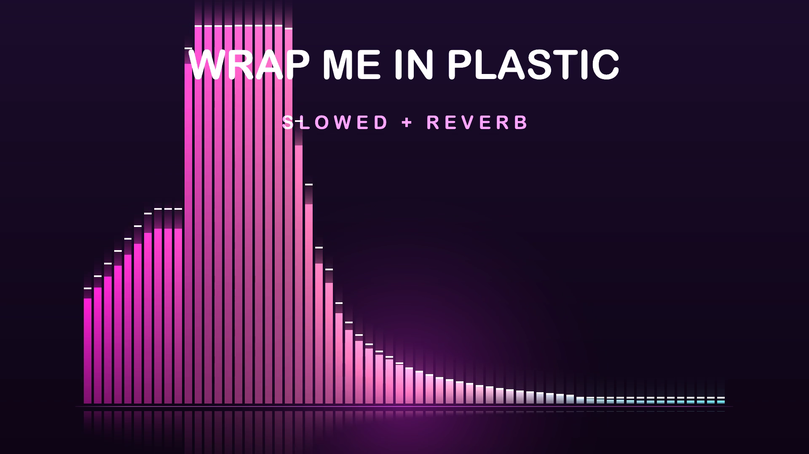

# songviz

Turn any song into a glowing bar-spectrum visualizer video — one command,
no plugins, no browser.

```bash
songviz "Wrap Me In Plastic.mp3" "video.mp4"
```



64 log-spaced FFT bars, bass-reactive glow, peak caps, floor reflection,
and an auto-fading title — rendered in real time on CPU and piped straight
into ffmpeg. **2.5 minutes of 1080p renders in about 35 seconds** on an
Apple Silicon Mac.

## Features

- **Any audio format** ffmpeg can read: mp3, m4a, flac, wav, ogg, opus…
- **Aspect presets** — landscape (1080p), vertical (Shorts/Reels/TikTok), square (IG)
- **6 palettes** — neon, sunset, ocean, mono, candy, matrix
- **Titles rendered into the video** (macOS CoreText, auto-shrink to fit)
- **Tunable** — bar count, fps, frequency range, sensitivity, quality
- **Fast** — real-time CPU FFT, zero temp image files, single-pass pipe

## Install

**Requirements:** [ffmpeg](https://ffmpeg.org) on PATH. macOS 12+ for
on-video titles (other platforms render fine, just without baked-in text).

```bash
git clone <this-repo> songviz && cd songviz
make            # builds src/render
make install    # optional: /usr/local/bin/songviz
```

Or without installing, run straight from the repo:

```bash
./bin/songviz song.mp3 out.mp4
```

## Usage

```
songviz [options] AUDIOFILE OUTPUT.mp4
```

| Option | Meaning | Default |
|---|---|---|
| `--landscape` / `--vertical` / `--square` | aspect preset | landscape 1920x1080 |
| `-t, --title TEXT` | title text (auto-shrinks) | — |
| `-s, --subtitle TEXT` | subtitle line | — |
| `-p, --palette NAME` | neon, sunset, ocean, mono, candy, matrix | neon |
| `--bars N` | number of bars (8–256) | 64 |
| `--fps N` | frame rate | 30 |
| `--gain X` | sensitivity: 0.5 calm, 2.0 jumpy | 1.0 |
| `--fmin/--fmax HZ` | spectrum range | 30–14000 |
| `--seconds S` | render only first S seconds | full song |
| `--crf N` | x264 quality (lower = better) | 18 |
| `--width/--height N` | custom size (overrides preset) | — |
| `--title-size/--subtitle-size N` | font size overrides | auto |

## Examples

```bash
# Classic YouTube visualizer
songviz -t "Midnight City" -s "M83" m83.mp3 video.mp4

# TikTok/Reels vertical, sunset palette, punchier bars
songviz --vertical -p sunset --gain 1.4 track.m4a reel.mp4

# Instagram square, minimal mono look
songviz --square -p mono --bars 48 song.flac post.mp4

# 30-second teaser for a long mix
songviz --seconds 30 djset.mp3 teaser.mp4
```

## How it works

`bin/songviz` decodes your audio to raw PCM with ffmpeg and pipes it into
`src/render`, a small C renderer:

1. **FFT** per frame (vDSP on macOS, FFTW elsewhere), Hann-windowed
2. Magnitudes grouped into **log-spaced bands** with perceptual weighting
3. **Slow AGC** normalizes quiet and loud songs to the same visual energy
4. Bars, glow, peaks, and reflections are **additively composited** onto an
   animated gradient; titles are rendered once with CoreText
5. Raw RGB frames stream into **ffmpeg → H.264 + AAC** in a single pass

## Platform notes

- **macOS**: full experience, including baked-in titles via CoreText.
- **Linux**: renders identically; CoreText titles are disabled
  (`SONGVIZ_NO_CORETEXT`). Needs `libfftw3-dev`.
- Both the CLI (`bin/songviz`) and the renderer binary
  (`songviz-render`) are installed by `make install`.

## License

MIT — see [LICENSE](LICENSE).
